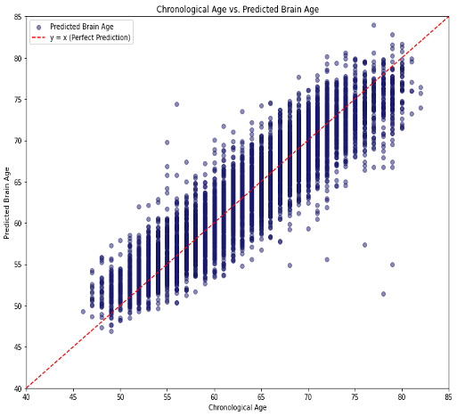
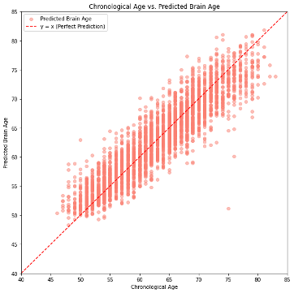
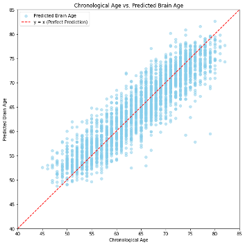
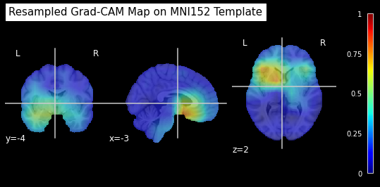
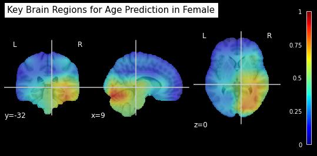
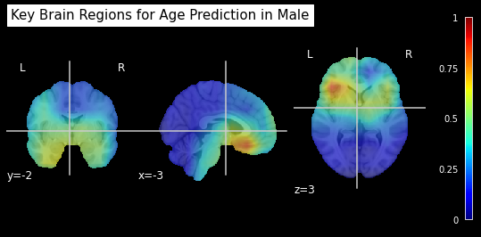

# Sex-Specific Brain Age Prediction

This folder contains code and results for predicting brain age using 3D-CNN with sex-specific models and Grad-CAM visualizations. The project explores the differences in brain age prediction between combined and gender-specific models.

## 📋 Data

This study utilized the UK Biobank (UKBB) dataset for brain MRI data. The UK Biobank is a large-scale biomedical database and research resource containing in-depth genetic, lifestyle, and health information from half a million UK participants.

Due to licensing restrictions, the dataset cannot be shared directly in this repository. Researchers interested in accessing the UK Biobank dataset can apply for access through the official portal: [UK Biobank Access](https://www.ukbiobank.ac.uk/enable-your-research/apply-for-access).

## 📂 Files
- `01_BA_Combined.ipynb`: Combined male and female model training + Grad-CAM visualization.
- `02_BA_Female.ipynb`: Female-specific model training + Grad-CAM visualization.
- `03_BA_Male.ipynb`: Male-specific model training + Grad-CAM visualization.

## 🛠️ How to Use
1. Clone this repository:
   ```bash
   git clone https://github.com/yourusername/SexSpecificBrainAgePrediction.git
   cd SexSpecificBrainAgePrediction


## 📊 Results

### Mean Absolute Error (MAE)
- **Combined Model (2.41)**:c
  
- **Female-Specific Model (2.47)**:
  
- **Male-Specific Model (2.63)**:
  

### Grad-CAM Visualizations
- **Combined Model**:
  
- **Female-Specific Model**:
  
- **Male-Specific Model**:
  

